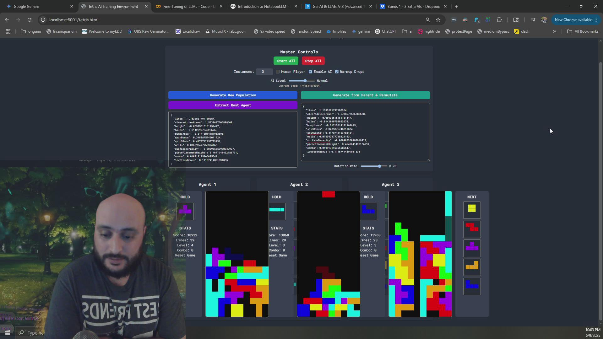
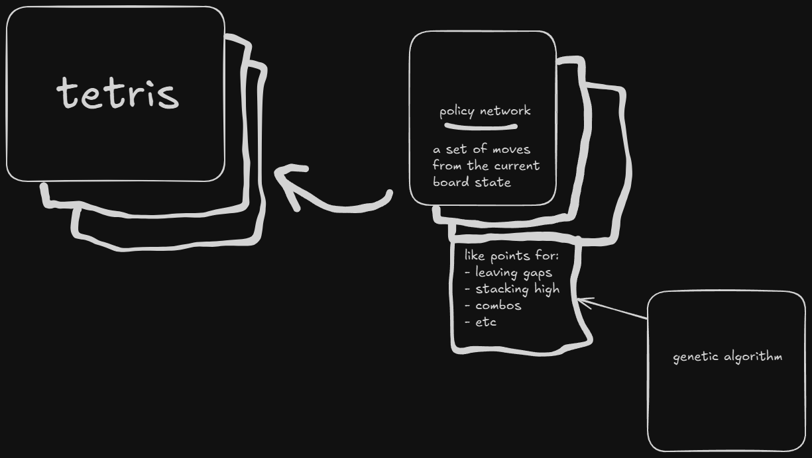

# About 
q-learning - https://en.wikipedia.org/wiki/Q-learning

genetic algorithm - https://en.wikipedia.org/wiki/Genetic_algorithm

reinforcement learning - https://en.wikipedia.org/wiki/Reinforcement_learning

reinforcement learning is a way of doing learning without a human in the loop, q-learning is a type of reinforcement learning, and genetic algorithms were used to modify a policy network/map - which is the decision of what action to do at what time
https://github.com/MatissesProjects/reinforcementLearningTetris

