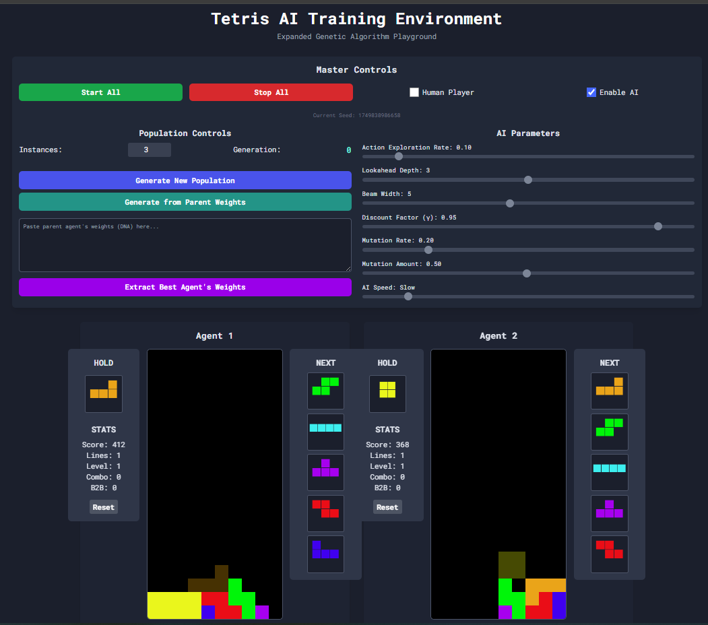
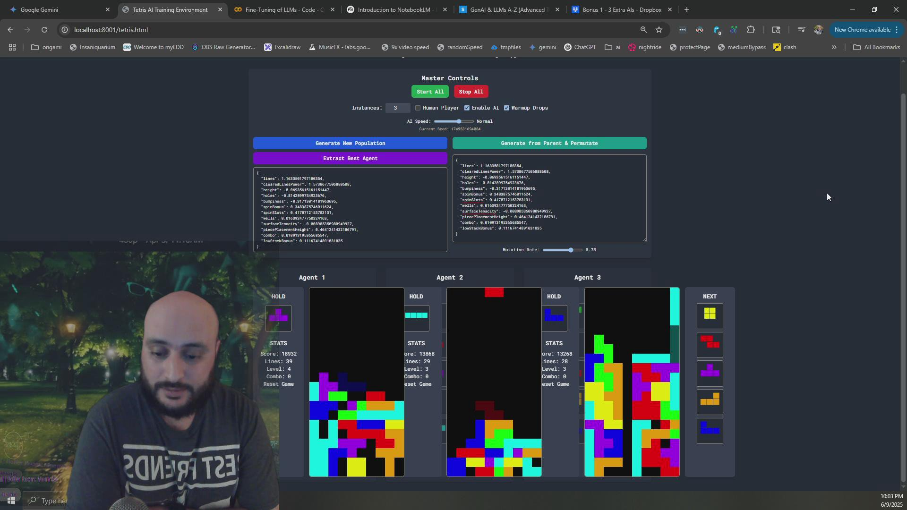
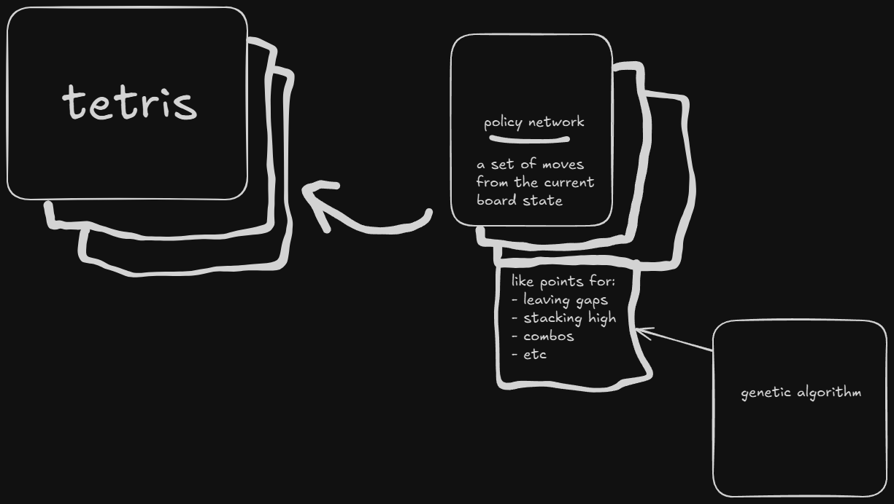

# How to use

In the ui to get started you can just click the start all

If you would like to play with the hyper parameters you can play with the AI parameters on the right, these will allow for exploration in the genetic algorithm space, and also do some speeding up of the game play (warning about speeding up the gameplay, do this before you start or it gets weird, will fix soon)

Once an agent is clearly the winner, or if you want to decide at any time you can select the "extract best agent's weights" button, this will give the currently best agents (currently just based on score) genetically created weights for its policy network. From there you can select the mutation rate and mutation amount.

Mutation rate is the percentage chance a metric will be modified

Mutation amount is a baseline minimum bump for how far it can go, in general this is +/- 50% + the mutation amount, so for small numbers this is important, for bigger numbers this is mostly ignored

The other AI parameters, like action exploration rate are for the system to not always chose the best option, so at default 10% of the time it will chose the second best option instead of the best, this is good for exploration of the possible board states. Lookahead depth is how many pieces it will focus on, 1 means just the current and hold piece, 5 means all five next pieces are taken into accouint. Beam width is the number of possible solutions the system will look for - you can think of 1 as a pure greedy algorithm, and more than that gives more possible looks ahead. Discount factor also plays into this, as the higher it is the more you care about the future movements, at 50% (lowest currently) you are doing a more greedy approach at the currently best move.

# About 
q-learning - https://en.wikipedia.org/wiki/Q-learning

genetic algorithm - https://en.wikipedia.org/wiki/Genetic_algorithm

reinforcement learning - https://en.wikipedia.org/wiki/Reinforcement_learning

reinforcement learning is a way of doing learning without a human in the loop, q-learning is a type of reinforcement learning, and genetic algorithms were used to modify a policy network/map - which is the decision of what action to do at what time
https://github.com/MatissesProjects/reinforcementLearningTetris

# Genetic Algorithm
currently tracking and evolving the following metrics

aggregateHeight

maxHeight

holes

coveredHoles

bumpiness

wells

rowTransitions

columnTransitions

linesClearedPower

combo

holdBonus

finessePenalty

t_spin_single_bonus

t_spin_double_bonus

t_spin_triple_bonus

mini_t_spin_single_bonus

mini_t_spin_double_bonus

l_spin_bonus

j_spin_bonus

s_spin_bonus

z_spin_bonus